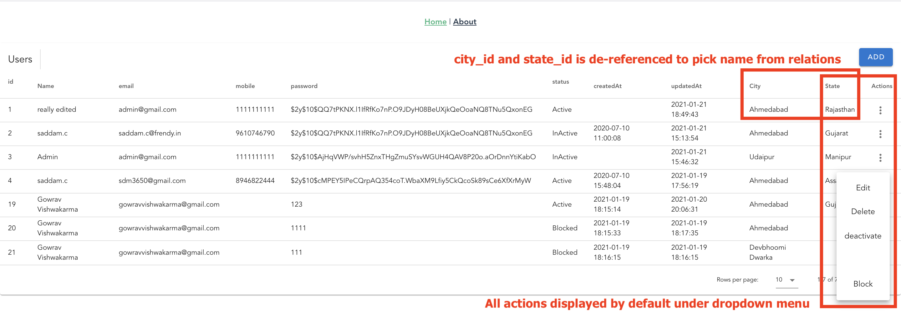
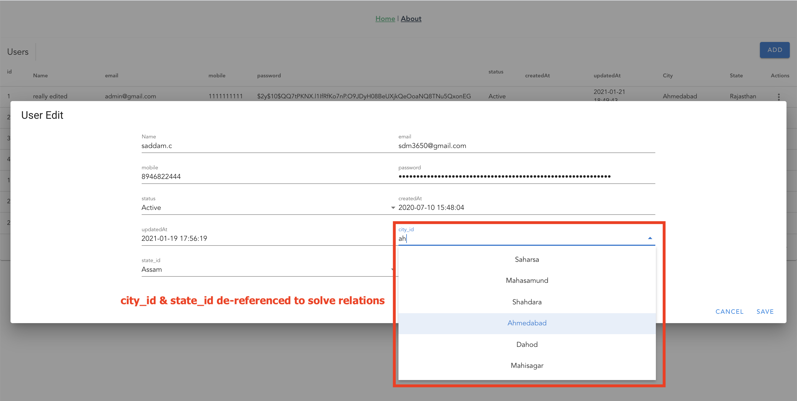
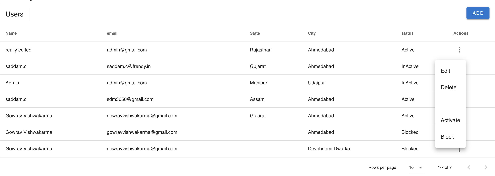
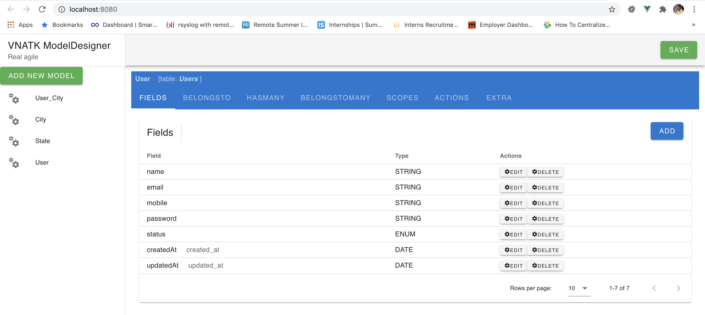

# BETA
---


## VNATK

VNATK is a set of client and server frameworks set to get your work started ASAP. Also we all know how tesdius it is to do maintenance of any project specially when client/company is ever changing their requirements. By looking at those issue I was missing somehting that really is fast, really RAPID APPLICATION DEVELOPMENT (RAD) framework.

So, here we are with two sets of frameworks, this VNATK-VUE and VNATK-EXPRESS-SEQULIZE.

Both repository contains same README file so pls follow proper link to go to respective repository.

Link to [VUEATK-VUE] (https://github.com/gowrav-vishwakarma/vnatk-vue) 

Link to [VUEATK-EXPRESS-SEQUELIZE] (https://github.com/gowrav-vishwakarma/vnatk-express-sequelize) 

# VNATK-EXPRESS-SEQULIZE (Backend with Express and Squelize)
---

equipped with a few endpoints that gives you all power with SequalizedSQL (pronounced `sec-QL`) developed by this project.

This express middleware will give all the fule required from server to VNATK Frontend Frameworks. 


Dependencies: body-parser, debug, dotenv,lodash, mysql2, sequelize


# VNATK-VUE (FrontEnd with Vue, Vuetify)
---

VNATKVUE is Frontend part of VNATK (Vue Node AgileTool Kit). Making app development easy by including some best practices as integral part, yet, giving you total customization options.


Dependencies: Vue (2.\*), Vuetify(2.\*), vue-form-base, lodash, dotenv


## Getting started

For simplicity we have our project folder structure as follows

```bash
Your Project Root Folder
 - client # Having vue fronetend
 - server # Having express-sequelize backend
```
In case you are working with microservice architecture, you can have following structure

```bash
Your Project Root Folder
 - VueClientAPP1
 - VueClientAPP2
 - ExpressBackendService1
 - ExpressBackendService2
 - ...
 - ExpressBackendService..N
```

# Step 1.0: setup express app
Considering we are in "Your Project Root Folder"

lets create express app (Server/service) from scratch, you are welcome to use any other way or manual if you know what you are doing

```bash
### FOR NEW SERVICE SETUP

#install express-generator globally, its easy to do setup with this
$yourProjectRoot> npm install -g express-generator
...
$yourProjectRoot> express server --no-view
...
#lets check if a folder with server name created or not
$yourProjectRoot> ls
server

#a default structure is also created in this folder
$yourProjectRoot> ls server
app.js       package.json routes    bin          public

$yourProjectRoot> cd server

#lets install basic things setup by express-generator
$yourProjectRoot/server> npm install

#install our dependencies now
$yourProjectRoot/server> npm install --save bcrypt body-parser cookie-parser express-handlebars jsonwebtoken morgan cors dotenv lodash mysql2 sequelize vnatk-express-sequelize

### If required vnatk-express-sequelize can be installed in existing express seuelize setup also with very ease

#install sequelize cli for easy sequlize setup
$yourProjectRoot/server> npm install --save-dev sequelize-cli
$yourProjectRoot/server> sequelize init

```
## Step 1.1: express app configurations

sequlize init creates ```config/config.json``` file but we need env access to config also rename ```config/config.json``` to ```config/config.js```

and REPLACE the follwoing content in `config/config.js` file (Complete content copy paste)

```js
require('dotenv').config();
const sequelize = require('sequelize')
const Op = sequelize.Op

module.exports = {
    "development": {
        "username": process.env.DB_USER_NAME || "root",
        "password": process.env.DB_PASSWORD || null",
        "database": process.env.DB_DATABASE || "your_awasome_db_name",
        "host": process.env.DB_HOST || "127.0.0.1",
        "dialect": "mysql",
        operatorsAliases: { $lt: Op.lt, $gt: Op.gt, $like: Op.like },
        "dialectOptions": {
            "dateStrings": true,
            "typeCast": true
        },
        "timezone": '+05:30'
    },
    "test": {
        "username": "root",
        "password": null,
        "database": "database_test",
        "host": "127.0.0.1",
        "dialect": "mysql",
        "operatorsAliases": false,
        "dialectOptions": {
            "useUTC": false, //for reading from database
            "dateStrings": true,
            "typeCast": true
        },
        "timezone": '+05:30'
    },
    "production": {
        "username": process.env.DB_USER_NAME || "root",
        "password": process.env.DB_PASSWORD || null,
        "database": process.env.DB_DATABASE || null,
        "host": process.env.DB_HOST || "127.0.0.1",
        "port": process.env.DB_PORT || "3306",
        "dialect": "mysql",
        "operatorsAliases": false,
        "dialectOptions": {
            "useUTC": false, //for reading from database
            "dateStrings": true,
            "typeCast": true
        },
        "timezone": '+05:30'
    }
}
```
since we changed json file to js, sequlize's default ```model/index.js``` file needs a change too, open this file and change 

```js
# some where at top replace config const declaration with the below line, look at 'json' removed

const config = require(__dirname + '/../config/config')[env];

```

sometimes sequelize have issues in reading models from file like this specially if your sequlize cli is old and you are  using seulize v6, in case of that, you may get sequelize import method error.

replace following line in that case

```js
// replace following line 
const model = sequelize['import'](path.join(__dirname, file));
//  to this line
    const model = require(path.join(__dirname, file))(sequelize, Sequelize.DataTypes)
```

## Step 1.2: configure and use vnatk-express-sequelize

Please add the following code in your `app.js` file. (DON'T COPY PASTE WHOLE FILE) 

```javascript
// somewhere on the top after 
// var express = require('express'); <= after this line
var cors = require('cors');
const bodyParser = require('body-parser');
const vnatk = require('vnatk-express-sequelize');
...
...
// You can already have body-parser added, no need to add again
app.use(bodyParser.json());
app.use(bodyParser.urlencoded({extended: true }));

// add cors is a good way and mostly you might need this also
app.use(cors()); // Use this after the variable declaration


const Models = require('./models');
app.use('/vnatk', vnatk({ // "/vnatk" will be your base path where the system will hit for its APIs
    Models: Models,
    router: express.Router()
}));
```
### Step 1.3: setup Models

Create models in ```models``` folder. For more about Models in sequlize please follow sequlize documentations.

Let's have a sample model. Please read Model comments as documentation. Some properties and methods are specific to VNATK.


```javascript
'use strict';
const { Model } = require('sequelize');

module.exports = (sequelize, DataTypes) => {
  class User extends Model {
    static associate(models) {
      // define association here
      // City and State Models must be created in same manner in models folder also
      User.belongsTo(models.City, { foreignKey: 'city_id' });
      User.belongsTo(models.State, { foreignKey: 'state_id' });

    }
    // you have to create this STATIC function in your model to tell what type of actions are doable on any model
    static vnAtkGetActions(models) {
      return [
        {
          // any identifier of action
          name: "deactivate",
          /* type defined at what level a action will be applicable
          'single'=> for Actions that are executable on any loaded row like activate, or deactivate.
          'NoRecords => for Actions that are doable at Model level ie sendEventInvitationToAll
          'MultiRecords' => for Actions that are doable on selected records by selecting checkboxes in data-grids ie submitSelected
          */
          type: 'single',
          // Your data-grid may have many records but if you want that action to be available only on specific conditions
          // put your where, make sure you have those columns available in model->attributes if defined ie status in bellow where
          where: {
            status: 'Active'
          },
          // actual function in this model to be called, created bellow
          execute: 'deActivate'
        },
        {
          name: "activate",
          type: 'single',
          // If you want a different caption on DataGrid or Forms for your field
          caption: 'Activate',
          where: {
            // Multiple conditions, Array is considered like OR
            // Multiple fields will be in AND Condition
            status: ['InActive', 'Blocked']
          },
          execute: 'activate'
        },
        {
          name: "block",
          type: 'single',
          caption: 'Block',
          where: {
            status: ['InActive', 'Active']
          },
          execute: 'block',
          /**
           * if defined "formschema" the action becoms UI based action and on click
           * will generate a form with proper validations etc. On Submitting this form
           * your "execute" value will be executed on model with sending all records of row along with these form values.
           * "EVERYTHING IS OVERRIDABLE AND CUSTOMIZABLE"
           * This is important. Even if you define something here, On Frontned you can override formfield, validations etc as per page to page need
           * and still all things will work like a charm.
           * For more about Form Schema please read at 
           * 
           * This is important link below
           * 
           * https://wotamann.github.io/ 
           */
          formschema: {
            reason: {
              type: "text",
              label: "reason",
            },
            password: {
              type: "text",
              ext: 'password',
              label: "Your Password to allow blocking",
              clearable: true,
              // solo: true,
              class: "mx-1 mt-1"
            },
          }
        },
      ]
    }
    // Actual function that will be called on loaded model
    // In other way of sequlize you define instance variable as 
    // sequelize.prototype=function () { ... }
    deActivate() {
      this.status = 'InActive'
      return this.save().then(self => {
        return self;
      })
    }

    activate() {
      this.status = 'Active'
      return this.save().then(self => {
        return self;
      })
    }

    // block action is defined with formschema in above vnAtkGetActions method and will receive that in formdata when submitted with record that is being executed with this method.
    block(formdata) {
      this.status = 'Blocked'
      return this.save().then(self => {
        return self;
      })
    }

  }

  // This init method is defined by 'define' method in other sequelize ways. technically its same ...

  User.init(
    {
      // WHILE SEQULIZE AUTOMATICALLY CONSIDER ID FIELD, FOR VNATK IT IS REQRUIED TO DEFINE AS FIELD
      id:{
        type: DataTypes.INTEGER,
        primaryKey: true,
        autoIncrement: true
      },
      name: {
        type: DataTypes.STRING,
        // caption is vnatk field property to define its caption at frontend
        caption: 'Name',
      },
      email: {
        validate: { isEmail: true },
        type: DataTypes.STRING,
        defaultValue: 'guest@example.com'
      },
      mobile: {
        type: DataTypes.STRING,
        validate: {
          isNumeric: {
            msg: 'Mobile number can only contains number',
            args: true
          },
        },
      },
      password: {
        type: DataTypes.STRING,
        ext: 'password' // VNATK Specific, for more ext please look at vue-form-base schemas system
      },
      status: DataTypes.ENUM('Applied', 'Active', 'InActive', 'Blocked'),
      createdAt: {
        type: DataTypes.DATE,
        field: 'created_at'
        isSystem:true // VNATK- isSystem will not be displayed default in Table or Add/Edit forms unless specified specifically
      },
      updatedAt: {
        type: DataTypes.DATE,
        field: 'updated_at',
        isSystem:true
      }
    },
    {
      sequelize,
      modelName: 'User',
    }
  );
  return User;
};
```

thats it... let's setup Vue frontend now

## Step 2: setup Vuetify app

You can add the system in existing Vue app also as long as you are already using ```Vuetify```

Considering we are in "Your Project Root Folder"

lets create express app (Server/service) from scratch, you are welcome to use any other way or manual if you know what you are doing

```bash
# just be sure you are in root of your project
$yourProjectRoot> ls
server

#install vue-cli globally if not installed 
$yourProjectRoot> npm install -g @vue/cli
$yourProjectRoot> vue create client
#follow wizard, I preferred default for beginners

$yourProjectRoot> ls
client  server

$yourProjectRoot> cd client
$yourProjectRoot/client> vue add vuetify
# I prefer defaults for now

#to make better use of views etc just add router
$yourProjectRoot/client> vue add router

$yourProjectRoot/client> npm install --save material-design-icons-iconfont axios vuetify-form-base vnatk-vue
```

### Step 2.1: setup VNATK-VUE

We are all set to use our system with defined model as in Back

First we need to update ```plugins/vuetify.js``` file as per given code

```javascript
import Vue from 'vue';
import 'material-design-icons-iconfont/dist/material-design-icons.css'
import 'vuetify/dist/vuetify.min.css'
import Vuetify from "vuetify";

Vue.use(Vuetify, {
    iconfont: 'md',
});

export default new Vuetify({
});
```

Also the default setup does not usage ```v-app``` from vuetify but just a div in ```src/App.vue```. Lets edit that file also like following

```vue
<template>
<!-- this below v-app was div in starting -->
  <v-app id="app"> 
    <div id="nav">
      <router-link to="/">Home</router-link> |
      <router-link to="/about">About</router-link>
    </div>
    <router-view />
  </v-app>
</template>

```
### Step2.2: setup services / axios connections


To connect our service/server let's create a folder ```services``` in your project ```src``` folder. Considering server/service we created in express setup above, is for customers. Create a file ```customer.js``` in services folder and place the following code there

```js
import axios from "axios";

const api = axios.create({
  baseURL: process.env.VUE_APP_BASE_URL_CUSTOMER || "http://localhost:3000"
});

export default api;
```

### Step2.2: Create Vue Views
Our system is ready to rock, now we will just create ```models``` and ```methods``` in Sequlize at server side and ```views/page``` in Vue Frontend, The rest logic is well done by itself.

for now open ```views/Home.vue``` file and place the following content to see the magic

```vue
<template>
  <vnatk-crud :options="crudoptions"> </vnatk-crud>
</template>

<script>
import { VnatkCrud } from "vnatk-vue";
import customer from "../services/customer";

export default {
  name: "SampleCRUD",
  components: {
    VnatkCrud,
  },
  data() {
    return {
      crudoptions: {
        service: customer,
        model: "User",
        title: "Users",
      },
    };
  },
};
</script>
```

And your crud will be there with all avilable other actions also like the image below

Notice city_id and state_id is automatically de-refenced to have their respective names from associations and all defined actions are available in drop down menu of each row. 

By default system assumes ```name``` as title field that is shown instead of ID, but do not worry if you don't follow these notations, everything is customizable.



This is how edit form and functionality is created.



### REMEMBER, WE HAVE NOT CREATED OR TOUCHED ANYTHING ON SERVER SIDE AFTER CREATING MODELS AND JUST RUN SERVER.

Too much fields, let's start configuring options, just change the crud options on vue component data as follows

```js
data() {
    return {
      crudoptions: {
        service: customer,
        model: "User",
        title: "Users",
        // Use response or retrive, response to work on Array based data crud and retrive for API based data fetch
        // response: {idfield:'no', data:[{no:1,name:'x',age:20},{no:2,name:'y',age:20}],headers:[{text:'ID',value:'no',hide:true},{text,value},{}],actions:[{name,cation,type,formschema},{},{}]} // Provide data to skip service calling and managing Array dased data crud

        //retrive defines all options to define data retrive ie R IN CRUD
        retrive: {
          // model options are for your sequlize models, all same (for Operators you need to do a small trick here)
          modeloptions: {
            attributes: ["name", "email", "state_id", "city_id", "status"],
          },
        },
      },
    };
  },
```

and result is like 



And the configurations are easy to read and maintains. A complete configuration can be as follows.

WE ARE IN PROCESS TO HAVE A COMPLETE DOCUMENTATION AND TESTINGS. THIS IS JUST A WORKING PROTOTYPE. FUNCTIONAL BUT WILL BE REFACTORED FOR CODE QUALITY AND PERFORMANCE SOON.

REMEMBER WE ARE STILL 0.0.x ;)

# Detailed documentation of VNATK Components and respective options

<details>
<summary>&lt;vnatk-crud :options="crudoptions"&gt;</summary>

```html
<template>
  <vnatk-crud :options="crudoptions">
  <!-- You can override any column and give it your own format -->
    <template v-slot:item.City.name="{ item }">
      City: {{ item.City.name }}<br />
      City Status : {{ item.City.status }}
    </template>
  </vnatk-crud>
</template>

<script>
import { VnatkCrud } from "@/entry";
import customer from "./services/customer";

export default {
  name: "ServeDev",
  components: {
    VnatkCrud,
  },
  data() {
    return {
      crudoptions: {
        service: customer,
        model: "User",
        title: "Users",
        basepath: "/vnatk", //OPTIONAL, default to '/vnatk
        create: { // OPTIONAL, default to true, set true to add all fields in Model
          uititle: "Add New User",
          modeloptions: { // Sequlize model options
            attributes: ["name", "email", "status", "city_id", "password"],
          },
        },
        retrive: { // OPTIONAL, default to true, set true to retrive all fields, headers and actions
          modeloptions: { // Sequalize model options
            attributes: [
              "name",
              "email",
              "status",
              "state_id",
              "city_id",
              "mobile",
            ],
            // include: ["City", "State"],  // to get all attributes with including
            include: [
              {
                model: "City",
                attributes: ["name", "status"],
              },
              {
                model: "State",
                attributes: ["name", "status", "gst_code"],
              },
            ],
          },
          modelscope: false, // String for scope name or Boolean true for default scope or false for unscoped
          autoderef: true, // OPTIONAL, default true
          headers: true, // OPTIONAL, default true
          serversidepagination: true, // Skip to fetch all records and do pagination and sorting on client side
          datatableoptions: { // OPTIONAL, defaults to v-datatable options.sync
            multiSort: true,
            mustSort: false,
          },
        },
        update: { // OPTIONAL, defaults to true, set true to edit all non primary and system fields in crud
          uititle: "Edit User - {name}",
          modeloptions: { // Sequlize options to define what fields you want to allow to edit
            attributes: [
              "name",
              "email",
              "status",
              "city_id",
              "state_id",
              "mobile",
            ],
          },
        },
        delete: true, // OPTIONAL, default ture, set false to remove delete action
        actions: true, // OPTIONAL, default true, st false to hide all actions including add/edit and delete
        import: { // OPTIONAL, default undefined/false
          service: catalog,
          basepath: "/admin/vnatk",
          model: "Category",
          execute: "vnatk_import", // Class level function defined in defined model
          success: this.reloadPage, //callback with passed response from model function
        },
        ui: { // OPTIONAL, 
          defaultActionPlacement: "DropDown", // "DropDown" or "buttonGroup". Where you want your default actions in row dropdown menu or as button in action columns for direct access
        },
        override: { //OPTIONAL
          actions: [ // Override actions
            {
              name: "vnatk_edit", // edit action is given specially this name
              placeIn: "buttonGroup", // or "DropDown"
              // use this to merge formschema options
              formschemaoverrides: { // Override formschema sent from server
                mobile: {
                  label: "Mobile Number",
                },
                city_id: {
                  // titlefield - only used if field is reference/association type
                  // default titlefield is considered as name
                  titlefield: "City.name",
                  label: "Your City",
                  serviceoptions: { // OPTIONAL: Usefull if you are dealing with microservices
                    service: customer,
                    basepath: "/vnatk",
                    model: "City",
                    modelattributes: ["id", "name"],
                    searchfield: ["name"],
                    limit: 10,
                  },
                },
                email: {
                  clearable: true,
                },
                // state_id: {
                //   titlefield: "State.name",
                // no state_id related info is overrided, still working good, in this case: using same service to get details if id,name is required with default limit
                // },
              },
            },
            {
              name: "vnatk_add", // add action is given specially this name
              // use this to merge formschema options
              formschemaoverrides: {
                city_id: {
                  label: "Your City ... ",
                },
              },
            },
            {
              name: "activate",
              placeIn: "buttonGroup", // or "DropDown"
              icon: "mdi-format-align-left",
              caption: "Activate User",
              // formschema:{} // use this to override complete formschema
              // formschemaoverrides:{} // use this to merge formschema options
            },
            {
              name: "deactivate",
              placeIn: "buttonGroup",
              caption: "Deactivate",
              // icon: "mdi-format-align-left",
            },
            {
              name: "clientFunction",
              type: "NoRecord",
              execute: this.clientFunctionCallBack, // call this function if isClientAction to handle action, row items will be passed to function.
              isClientAction: true,
            },
          ],
          headers: { // OPTIONAL, override headers, hide, move position or create new columns
            city_id: {
              hide: true,
            },
            state_id: {
              hide: true,
            },
            mobile: {
              text: "User Mobile",
              sortable: false, // OPTIONAL, default to true
              // moveto: 0,
            },
            City: {
              // Override DeReferanced Fields (received from server due to autoderef)
              text: "Primary City", //Overrided header caption/text
              value: "City.name", // Value does not have effect as alrady overrided column by slot in template above
              // moveto: 2,
            },
            "State.gst_code": { // ADD a new column showing User.State.gst_code, look at how we included gst_code in retrive options model's include.
              text: "State GST Code",
              value: "State.gst_code",
              sortable: true,
              moveto: 4,
            },
            vnatk_actions: {
              moveto: "last", // Either +INT to move from left to right or -INT to move from right to left or "last" to move column to last
            },
          },
        },
      },
    };
  },

  methods: {
    // Defined custom local clientaction handler
    clientFunctionCallBack(item) {
      console.log("CLIENT FUNCTION CALLED with item", item);
    },
  },
};
</script>
```
</details>

<details>
<summary>&lt;model-designer :service="serviceInfo"&gt; </model-designer></summary>

Model Designer is an under development tool to define and design your models from front end, Till beta model designer
READS FROM `models` folder in express app BUT WRITES CHANGES IN copied files in `models/modeldesigner`.



```html
<template>
  <model-designer :service="serviceInfo"> </model-designer>
</template>

<script>
import { ModelDesigner } from "@/entry";
import customer from "./services/customer";

export default {
  name: "ModelDesginierExample",
  components: {
    ModelDesigner,
  },
  data() {
    return {
      serviceInfo: {
        service: customer,
        basepath: "/vnatk",
      },
    };
  },
};
</script>
```
</details>
